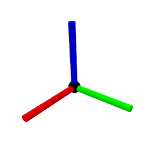

# meshcat-shapes

[](https://github.com/stephane-caron/robot_descriptions.py/actions)
[](https://coveralls.io/github/stephane-caron/robot_descriptions.py?branch=master)
[](https://pypi.org/project/robot_descriptions/)

[](https://github.com/stephane-caron/robot_descriptions.py/tree/master/CONTRIBUTING.md)

Useful shapes to decorate MeshCat scenes.

## Installation

```console
pip install meshcat-shapes
```

## Shapes

| Shape | Preview |
|-------|---------|
| Frame |  |

## Usage

```python
...
```
